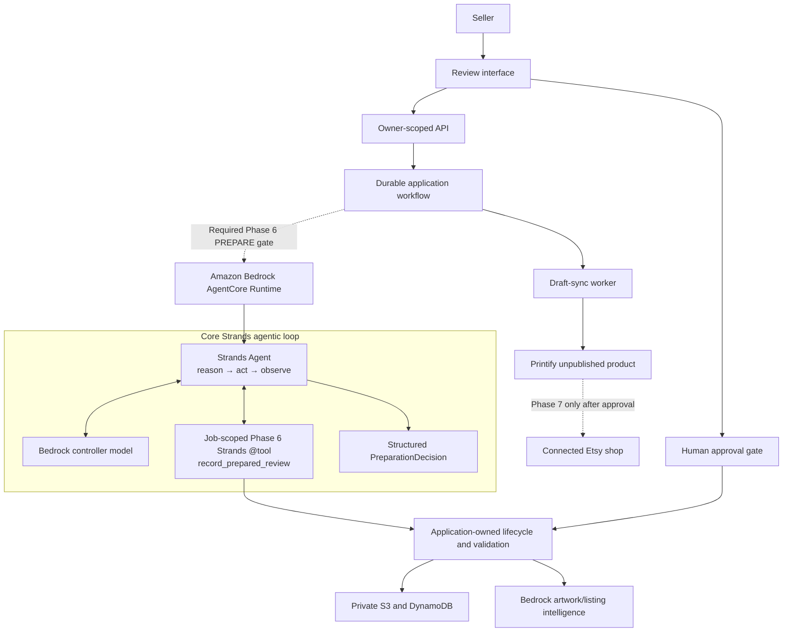

# Mr Lister

**Your POD Listing Partner** *(working tagline)*

Mr Lister turns finished artwork into a configured, validated, reviewable print-on-demand
listing. It combines bounded AI judgment with deterministic marketplace and publishing
safeguards.

> [!IMPORTANT]
> **Mr Lister is built with the Strands Agents SDK.** Strands runs the bounded preparation agent
> loop—controller model, job-scoped tools, reasoning, and structured response—inside Amazon
> Bedrock AgentCore. It is not an unused dependency or a label around a direct model call. Start
> with [the agent construction](src/mr_lister/agent/runtime.py),
> [the real `@tool` implementations](src/mr_lister/agent/tools.py), and the
> [judge-facing evidence map](docs/strands-submission-evidence.md).

The Phase 6 product path is deliberately bounded:

> One submission with one or more artworks -> one independent job and calibrated unpublished
> Printify product per accepted file -> seller review -> exact-version approval -> STOP.

Etsy publication is Phase 7. It is disabled and is not part of the Phase 6 acceptance path. The
implemented safety core and the ordered path to read-only validation, one-listing canary, general
availability, and seal are tracked in the
[`Phase 7 execution map`](docs/phase7-execution-map.md).

## Why it exists

Creating a POD listing is a workflow disguised as a form. Sellers repeatedly inspect artwork,
choose product settings, place designs, set prices, draft copy, build tags, validate fields,
publish, and verify. Mr Lister turns that repeated operational work into a guided approval
flow while keeping the seller in control of publication.

## Built with Strands Agents SDK

The real SDK path instantiates `strands.Agent`, selects a capability-scoped tool set for one
trusted job, applies bounded turn/token limits, invokes the Strands loop, and validates its
structured `PreparationDecision`. The agent can prepare, inspect, validate, explain, and propose
revisions. Application code—not the model or agent—remains authoritative for lifecycle state,
approval, cancellation, idempotency, and irreversible marketplace actions.

| Proof | Public location |
| --- | --- |
| `strands.Agent` construction, limits, invocation, and structured output | [`src/mr_lister/agent/runtime.py`](src/mr_lister/agent/runtime.py) |
| Four genuine, job-scoped Strands `@tool` functions | [`src/mr_lister/agent/tools.py`](src/mr_lister/agent/tools.py) |
| Official AgentCore SDK entry point and Bedrock controller | [`src/mr_lister/agent/agentcore_sdk.py`](src/mr_lister/agent/agentcore_sdk.py) |
| Credential-free execution of the actual Strands loop | [`tests/test_strands_real_loop.py`](tests/test_strands_real_loop.py) |
| Durable Phase 6 single-tool Strands runtime and exact AgentCore bridge | [`src/mr_lister/agent/phase6.py`](src/mr_lister/agent/phase6.py), [`src/mr_lister/control/agentcore.py`](src/mr_lister/control/agentcore.py) |
| Credential-free Phase 6 checkpoint, tool, correlation, and resume proof | [`tests/test_phase6_strands_runtime.py`](tests/test_phase6_strands_runtime.py), [`tests/test_phase6_agentcore_bridge.py`](tests/test_phase6_agentcore_bridge.py) |
| Same-job consolidated seller projection with sanitized Strands provenance | [`src/mr_lister/control/projection.py`](src/mr_lister/control/projection.py), [`docs/phase6-review-projection.md`](docs/phase6-review-projection.md) |
| Deployed AgentCore canary and tool-selection results | [`docs/phase3-controller-evaluation.md`](docs/phase3-controller-evaluation.md) |
| Requirement-to-code/test/demo traceability | [`docs/strands-submission-evidence.md`](docs/strands-submission-evidence.md) |

Phase 6 is deployed and sealed for the functional hackathon-demo scope. Its durable `PREPARE`
bridge runs the genuine single-tool Strands path, and the owner-scoped seller review joins that
same job's artwork, listing, product, mockups, validation, economics, and sanitized Strands
provenance. The final MassSkutiny walkthrough completed the authenticated production flow through
seller approval while the Printify draft remained editable and unpublished. The frozen Phase 6.6
manifest's broader deployed-canary and moderated-research evidence remains explicit post-demo
hardening and is not claimed as completed. That distinction is tracked in the
[phase checklist](docs/phase-checklist.md),
[authoritative Phase 6 release-state record](docs/phase6-release-state.md),
[Phase 6.2](docs/phase6-provider-integration.md), and
[Phase 6.3](docs/phase6-review-projection.md) evidence.

### Verify Strands locally in 60 seconds

```bash
source .venv/bin/activate
python -m pytest -q \
  tests/test_strands_setup.py \
  tests/test_strands_real_loop.py \
  tests/test_agent_tools.py \
  tests/test_agentcore_sdk.py \
  tests/test_phase6_strands_runtime.py \
  tests/test_phase6_agentcore_bridge.py
```

## Phase 6 seller workspace

The Phase 6.5 implementation includes a strict React/TypeScript seller application under
[`web/`](web/). It accepts one or multiple PNG, safe self-contained SVG, or JPG/JPEG artworks;
validates and preserves PNG bytes while normalizing SVG and JPG/JPEG to proportional canonical PNG
without cropping, padding, distortion, or square enforcement; and gives every file its own private
job and progress/recovery state. It also
provides consolidated artwork/listing/mockup/economics review, a prominent same-job Strands
evidence card, and the five server-authorized seller actions. The interface keeps
**Unpublished — not on Etsy** visible throughout and contains no browser publication, order, or
fulfillment capability.

The accompanying SAM application defines a private CloudFront/OAC web origin, same-origin cache-disabled
`/v1/*`, exact Cognito PKCE runtime configuration, CSP/security headers, and allowlisted SPA
routing. The browser contract is exported from Python into versioned JSON Schema and fixtures, so
backend/frontend drift fails CI.

```bash
cd web
npm ci
npm run check
```

The seller UI and private hosting topology are deployed as the sealed Phase 6 functional-demo
release. The production walkthrough proved the authenticated same-job review and approval path;
the stricter frozen hardening evidence remains separately tracked. See
[`docs/phase6-accessible-seller-interface.md`](docs/phase6-accessible-seller-interface.md) and
[`docs/architecture/0012-phase65-browser-and-hosting-boundary.md`](docs/architecture/0012-phase65-browser-and-hosting-boundary.md).

## Target submission architecture



The model may interpret artwork, draft listing text, and explain revisions. It may not set
publication authority, bypass validation, invent operational policy, or duplicate an external
write. Those responsibilities remain in deterministic code and explicit configuration.

## Foundation

Phase 0 established:

- versioned domain contracts;
- explicit job states and transition rules;
- publication and approval invariants;
- a documented demo-product target;
- architecture decision records;
- a security and privacy baseline;
- a proof ledger for validated assumptions;
- local tests and continuous integration.

Live AWS, Bedrock, Printify, and Etsy connections were intentionally excluded from that phase.

## Local development

Requirements: Python 3.12.

```bash
python3.12 -m venv .venv
source .venv/bin/activate
python -m pip install -e '.[dev]'
pytest
ruff check .
```

## Phase 1 local API

Phase 1 provides a synchronous local workflow with in-memory state, deterministic validation,
fake Bedrock intelligence, and fake Printify publication. It performs no network requests or
external writes.

```bash
source .venv/bin/activate
uvicorn mr_lister.api.app:app --reload
```

The API is available at `http://127.0.0.1:8000`, with interactive OpenAPI documentation at
`/docs`. Its vertical slice exposes:

- `POST /jobs`
- `GET /jobs/{job_id}`
- `GET /jobs/{job_id}/review`
- `PUT /jobs/{job_id}/review/listing`
- `POST /jobs/{job_id}/approve`
- `POST /jobs/{job_id}/publish`
- `GET /jobs/{job_id}/report`

The local API wires the bundled `synthetic_gildan_5000` profile only to the fake adapter. Its
deliberately non-live identifiers cannot create a real Printify product.

## Phase 2 Bedrock intelligence

The completed Phase 2 implementation adds a provider-neutral Amazon Bedrock Converse adapter. It creates a
bounded inspection rendition from the seller's original PNG, asks the configured model for artwork
analysis and listing intelligence, and then applies stricter application-owned contracts.
Unsupported outputs receive only a configuration-bounded number of semantic repair attempts. The
Nova development profile permits two so it can perform a second global tag-diversity cleanup.

Prompt version `2026-08-18.7` first inventories concrete visual elements before interpretation and
asks for a ranked pool of 18–30 buyer-relevant tag phrases. Application code selects the strongest
feasible 13-tag subset without repeated meaningful keywords. An unusable pool receives bounded
repair and cannot cross the intelligence boundary; human-edited listings remain subject to the
same deterministic validation before production or approval.

Routine development uses the deterministic fake adapter. Cost-gated live evaluation currently
uses Gemma 3 27B as the provisional quality lead; Amazon Nova 2 Lite remains the low-cost baseline,
while OpenAI GPT-5.6 Luna and Claude Sonnet 4.6 are optional benchmarks. All paths must pass the
same application validation before reaching human review.

The default application and test suite remain offline. Real model traffic requires an explicit
environment gate, uses fake production, and must stop at human review; AWS credentials alone do
not silently select the live adapter.

```bash
python -m tools.phase2_evaluation --check-assets
pytest -m "not live_bedrock"
```

See the [Phase 2 AWS runbook](docs/aws-bedrock-phase2.md) for narrow IAM policies, the AWS-credit
guardrail, optional Anthropic activation, and cost-controlled canary commands. The
[evaluation guide](tests/evaluation/README.md) documents the eleven-case split harness, repeated
trials, and provider comparisons.

## Phase 3 Strands and AgentCore

Phase 3 is complete. Amazon Nova 2 Lite is the selected capability-scoped Strands controller;
Gemma 3 27B remains the image/listing-intelligence worker. Each invocation is bound to one job and
one application-selected mode. Preparation can move validated intake to staged human review;
review exposes inspection and validation, while revise additionally exposes listing revision. The
agent has no approval or publication tool.

The official AgentCore SDK boundary provides `GET /ping` and `POST /invocations`. Runtime version 2
is deployed in `us-west-2` as a narrow Linux ARM64 CodeZip with an external least-privilege runtime
role. Its live canary selected only inspection and validation tools, required human approval,
denied publication authority, and emitted a digest-only audit record. The deployment remains a
synthetic controller canary with fake production—not the complete production application.

See the [Phase 3 architecture decision](docs/architecture/0007-capability-scoped-strands-agent.md)
and [AgentCore runbook](docs/aws-agentcore-phase3.md) for the enforced boundary and deployment
sequence.

## Core product rules

- AI is used only where interpretation or generation is valuable.
- Model output must pass a strict application-owned contract.
- Prices are represented as integer cents.
- Every external write is idempotent and traceable.
- Approval is bound to an immutable review version.
- Editing an approved review invalidates approval.
- Publication can occur only from the approved state.
- Credentials and private payloads never enter prompts or ordinary logs.
- A failed item retains its source and diagnostic record.

## Roadmap

See the [roadmap](docs/roadmap.md), [demo target](docs/demo-target.md), and
[phase checklist](docs/phase-checklist.md) for current progress. The
[architecture decisions](docs/architecture) record the governing technical choices.

## License

Licensed under the [Apache License 2.0](LICENSE).
