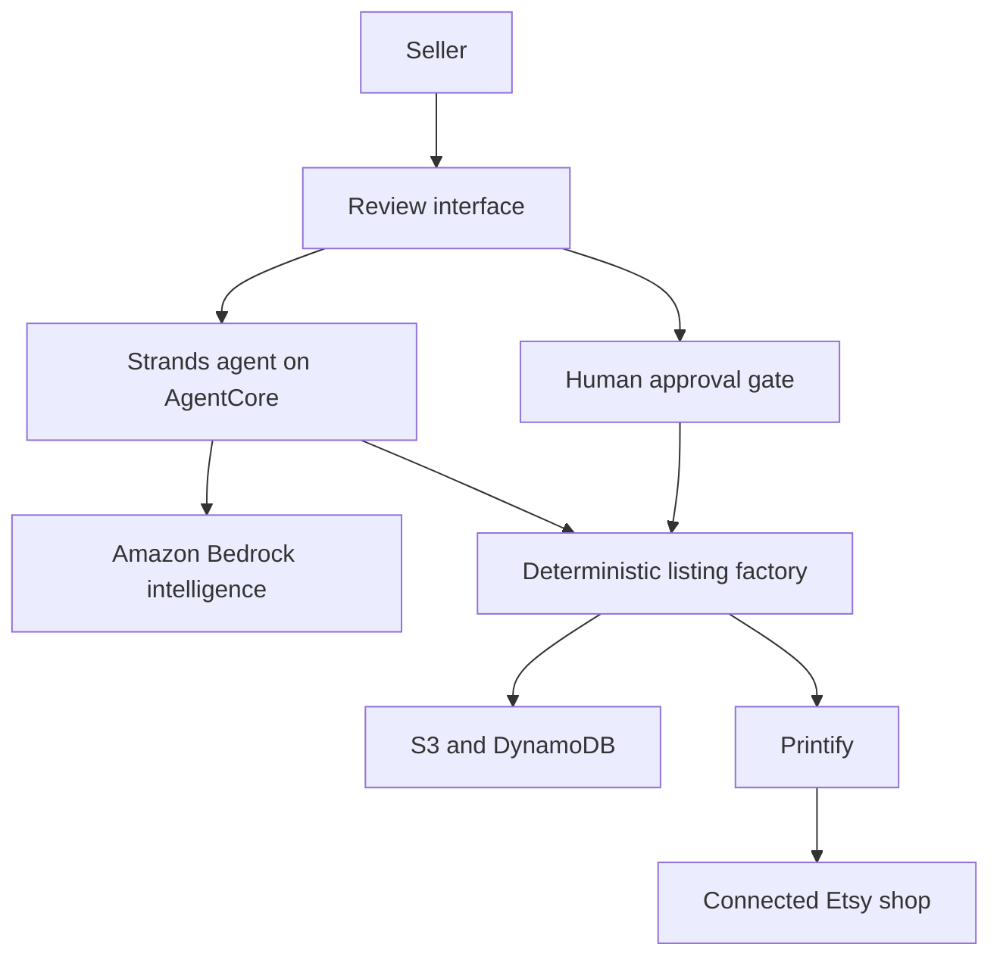

# Mr Lister

**Your POD Listing Partner** *(working tagline)*

Mr Lister turns finished artwork into a configured, validated, reviewable print-on-demand
listing. It combines bounded AI judgment with deterministic marketplace and publishing
safeguards.

The initial product path is deliberately narrow:

> One artwork file -> one calibrated apparel product -> one reviewed listing -> one approved
> publication through Printify to Etsy -> one verified result.

## Why it exists

Creating a POD listing is a workflow disguised as a form. Sellers repeatedly inspect artwork,
choose product settings, place designs, set prices, draft copy, build tags, validate fields,
publish, and verify. Mr Lister turns that repeated operational work into a guided approval
flow while keeping the seller in control of publication.

## Architecture



The model may interpret artwork, draft listing text, and explain revisions. It may not set
publication authority, bypass validation, invent operational policy, or duplicate an external
write. Those responsibilities remain in deterministic code and explicit configuration.

## Phase 0 scope

This repository currently establishes:

- versioned domain contracts;
- explicit job states and transition rules;
- publication and approval invariants;
- a documented demo-product target;
- architecture decision records;
- a security and privacy baseline;
- a proof ledger for validated assumptions;
- local tests and continuous integration.

Live AWS, Bedrock, Printify, and Etsy connections are intentionally excluded from Phase 0.

## Local development

Requirements: Python 3.12.

```bash
python3.12 -m venv .venv
source .venv/bin/activate
python -m pip install -e '.[dev]'
pytest
ruff check .
```

## Phase 1 local API

Phase 1 provides a synchronous local workflow with in-memory state, deterministic validation,
fake Bedrock intelligence, and fake Printify publication. It performs no network requests or
external writes.

```bash
source .venv/bin/activate
uvicorn mr_lister.api.app:app --reload
```

The API is available at `http://127.0.0.1:8000`, with interactive OpenAPI documentation at
`/docs`. Its vertical slice exposes:

- `POST /jobs`
- `GET /jobs/{job_id}`
- `GET /jobs/{job_id}/review`
- `PUT /jobs/{job_id}/review/listing`
- `POST /jobs/{job_id}/approve`
- `POST /jobs/{job_id}/publish`
- `GET /jobs/{job_id}/report`

The local API wires the bundled `synthetic_gildan_5000` profile only to the fake adapter. Its
deliberately non-live identifiers cannot create a real Printify product.

## Core product rules

- AI is used only where interpretation or generation is valuable.
- Model output must pass a strict application-owned contract.
- Prices are represented as integer cents.
- Every external write is idempotent and traceable.
- Approval is bound to an immutable review version.
- Editing an approved review invalidates approval.
- Publication can occur only from the approved state.
- Credentials and private payloads never enter prompts or ordinary logs.
- A failed item retains its source and diagnostic record.

## Roadmap

See the [roadmap](docs/roadmap.md), [demo target](docs/demo-target.md), and
[architecture decisions](docs/architecture) for the dependency-ordered build plan and its
governing technical choices.

## License

Licensed under the [Apache License 2.0](LICENSE).
